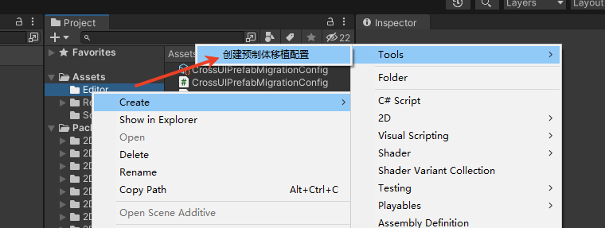
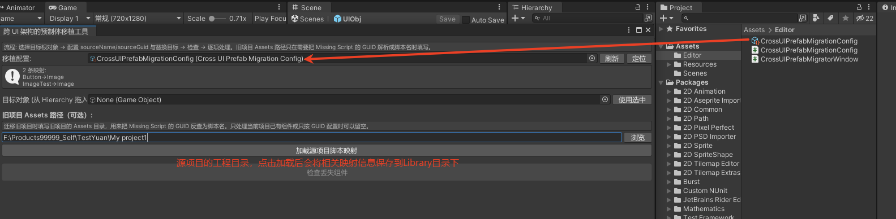
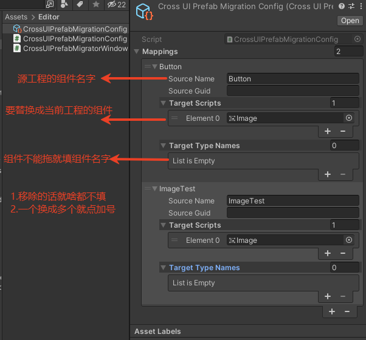
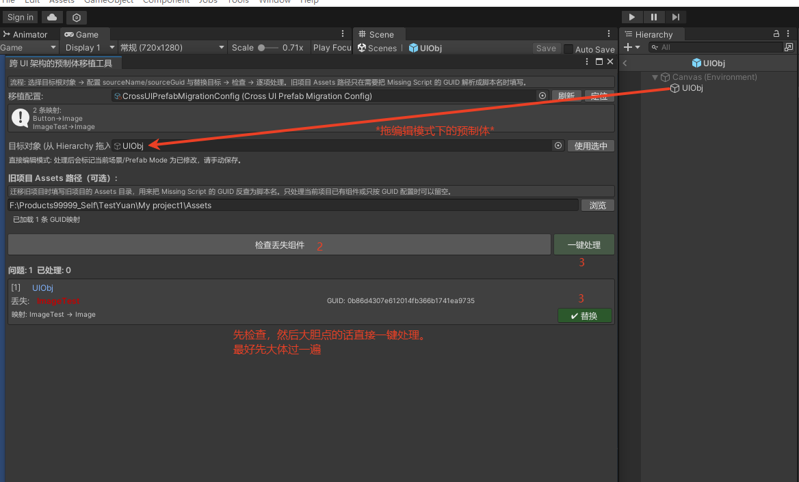

# Unity Cross-UI Prefab Migration Tool

This tool is designed for migrating from an old UI framework to a new UI framework. It batch-checks Prefabs or Scenes for Missing Script entries, then replaces old components with new components according to configuration, or safely removes old components that are no longer needed.

It is suitable for the following scenarios:

- Old project scripts are missing, leaving only Missing Script entries on Prefabs.
- The old and new UI frameworks use different component names, script GUIDs, or component types, and batch replacement is required.
- You want to scan all problematic nodes first, then handle them one by one or process them in one click.
- When migrating a large number of UI Prefabs, you need to use `.meta` files from the old project to resolve Missing Script GUIDs back to old script names.

## Features

- Loads the old project's `Assets` directory and builds a `GUID -> script name` cache.
- Uses a `ScriptableObject` asset to configure migration rules.
- Supports one-by-one replacement, one-by-one removal, and one-click processing.
- Supports replacing old components that still exist in the current project but need to be migrated.

## Installation

### Option 1: Import the unitypackage

Import the following package into your Unity project:

```text
package/UiPrefabMigration.unitypackage
```

After import, the tool scripts will be generated under `Assets/Editor`.

### Option 2: Copy the source files

Copy the following files to the `Assets/Editor` directory of the target Unity project:

```text
Project/Assets/Editor/CrossUIPrefabMigratorWindow.cs
Project/Assets/Editor/CrossUIPrefabMigrationConfig.cs
```

If no configuration asset exists, the tool will automatically create a default configuration when opened:

```text
Assets/Editor/CrossUIPrefabMigrationConfig.asset
```

## Requirements

- Example project version: Unity `2018.4.19f1`; Unity 2021 is also compatible.
- This tool is an Editor extension and must be placed under an `Editor` directory.

## Screenshots

### 1. Create a Migration Configuration

Right-click in the Project window to create a configuration asset:

```text
Create > Tools > 创建预制体移植配置
```



### 2. Select Configuration and Load Old Project Mapping

```text
Tools > 跨 UI 架构 > 预制体移植工具
```

The tool window displays the current migration configuration, mapping summary, target object, old project `Assets` path, and scan button.

The old project path is used to read `.cs.meta` files from the old project and resolve script GUIDs to script names. Mapping information is cached under `Library/CrossUIPrefabMigrator` in the current project.



### 3. Configure Component Mapping Rules

Each rule represents one migration mapping:

```text
sourceName/sourceGuid -> targetScripts + targetTypeNames
```

Examples:

```text
Button    -> Image
ImageTest -> Image
```



Field descriptions:

| Field | Description |
| --- | --- |
| `sourceName` | Original script name or original component name. Suitable when the old script name can be identified, or when replacing old components that still exist in the current project. |
| `sourceGuid` | Original script GUID. Suitable when the old script is already missing and the GUID can only be read from Prefab/Scene YAML. |
| `targetScripts` | List of new scripts to replace with. Drag `.cs` script files directly into this field. |
| `targetTypeNames` | Component type names to replace with, such as `RectTransform`, `CanvasGroup`, `Image`, `Button`, or `TextMeshProUGUI`. |

If both `targetScripts` and `targetTypeNames` are empty, the rule means only removing the old component without adding any new component.

### 4. Scan and Process

After scanning, the tool lists problematic nodes, old component names, GUIDs, and their corresponding mappings. You can process items one by one, or run one-click processing after confirming that the results are correct.



## Processing Modes

### Prefab Mode

When selecting a root object in Prefab Mode, the tool directly processes the currently opened Prefab contents. After processing, the Prefab is marked as modified and must be saved manually.

## Notes

- Before migration, it is recommended to commit your changes to Git or back up the Prefabs/Scenes.
- The replacement logic is: remove the old component or Missing Script, then add the new component. It does not automatically migrate serialized field values from the old component.
- Unity's official API `GameObjectUtility.RemoveMonoBehavioursWithMissingScript` removes all Missing Script entries on the same GameObject at once. The tool will also mark other missing entries on the same node accordingly.
- Scripts in `targetScripts` must be resolvable as `Component` types; otherwise, they will not be added.
- `targetTypeNames` will be resolved from `UnityEngine`, `UnityEngine.UI`, `UnityEngine.EventSystems`, `TMPro`, and currently loaded assemblies.
- If a scan result reports that a node cannot be found, make sure the dragged-in object is the same root object used during scanning.
- For complex Prefabs, it is recommended to replace items one by one first. After confirming the result, use one-click processing.

## FAQ

### Why are the new component fields reset to default values after replacement?

The tool currently handles component-level migration only. It does not migrate field-level data. After a new component is added, Unity's default serialized values are used. Field data must be filled in manually, or the tool can be extended according to your project rules.

### Is one-click processing safe?

One-click processing is suitable when the mapping rules have already been confirmed. When migrating a specific type of Prefab for the first time, it is recommended to verify the result with one-by-one processing first.
